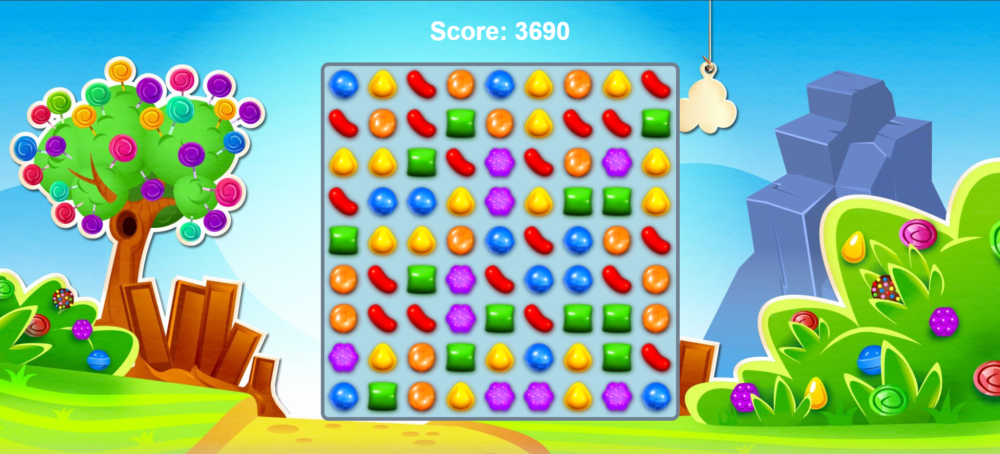

# 🍬 Candy Crush Clone 

A browser-based **Candy Crush–style match-3 game** built with **pure HTML, CSS, and JavaScript**.  
Play directly in the browser, track your score, and enjoy a simple 9×9 puzzle grid!

## 🎮 Features
- 9×9 grid for gameplay
- Match-3 detection and clearing
- Score tracking
- Fully static: no backend required
- Easy to deploy on GitHub Pages

## 📂 Files in the Repository
- `index.html` – main HTML file
- `candy.css` – styles for the game board and candies
- `candy.js` – JavaScript logic for gameplay and scoring

## 🚀 How to Play
1. Open `index.html` in any browser.
2. Swap adjacent candies to make matches of 3 or more.
3. Matches are cleared and score updates automatically.

